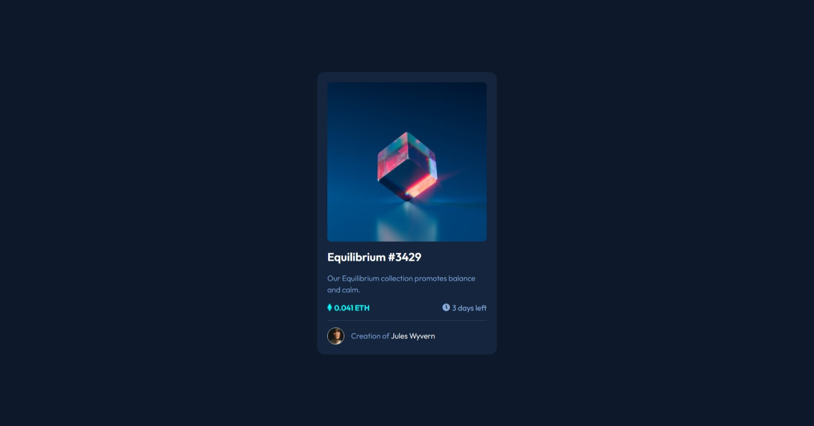
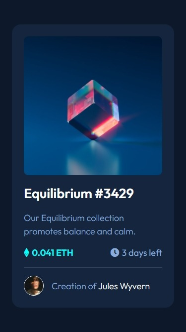

# Frontend Mentor - NFT preview card component solution

This is a solution to the [NFT preview card component challenge on Frontend Mentor](https://www.frontendmentor.io/challenges/nft-preview-card-component-SbdUL_w0U). Frontend Mentor challenges help you improve your coding skills by building realistic projects.

## Table of contents

- [Overview](#overview)
  - [The challenge](#the-challenge)
  - [Screenshot](#screenshot)
  - [Links](#links)
- [My process](#my-process)
  - [Built with](#built-with)
  - [What I learned](#what-i-learned)
  - [Continued development](#continued-development)
  - [Useful resources](#useful-resources)
- [Author](#author)

## Overview

### The challenge

Users should be able to:

- View the optimal layout depending on their device's screen size
- See hover states for interactive elements

### Screenshot

#### Desktop Screenshot

#### Mobile Screenshot

### Links

- Solution URL: [Add solution URL here](https://your-solution-url.com)
- Live Site URL: [https://dharmik48.github.io/fem-nft-card/](https://dharmik48.github.io/fem-nft-card/)

## My process

### Built with

- Semantic HTML5 markup
- CSS custom properties
- Flexbox
- CSS Grid
- Mobile-first workflow
- BEM naming convention

### What I learned

This was the first project in which I utilized the BEM naming convention for naming classes.

### Continued development

I am surely going to continue using the BEM convention in my future projects.

### Useful resources

- [Font Awesome](https://fontawesome.com/) - Got the icons from here.
- [Google Fonts](https://fonts.google.com/) - This is the best place to get free hight quality fonts. This project used the [Outfit](https://fonts.google.com/specimen/Outfit) font.

## Author

- GitHub - [Dharmik48](https://github.com/Dharmik48)
- Frontend Mentor - [@Dharmik_487](https://www.frontendmentor.io/profile/Dharmik48)
